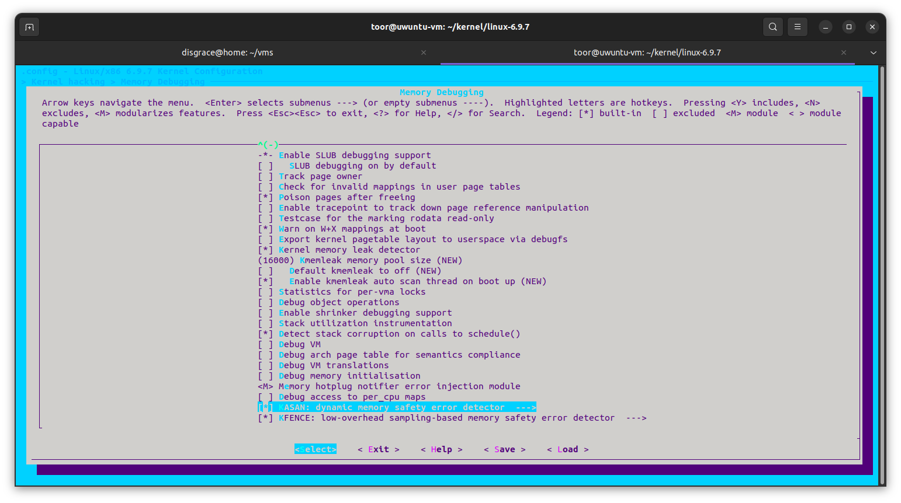

# INT-13, Stage-2 | Kernel module
#### done by Yashnikov Valeriy at ho1lodno@yandex.ru

# driver developing
## basics
first of all, we should can read and write in kernel space.
```C
static ssize_t proc_read(struct file *file, char __user *buf, size_t count, loff_t *pos) {
    // ...
}

static ssize_t proc_write(struct file *file, const char __user *buf, size_t count, loff_t *pos) {
    // ...
}
```
## detailing RW
### read
added __proc_read__ function reads data from kernel space memory and copies it to user space using the copy_to_user function.
```c
ssize_t proc_read(struct file *file, char __user *buf, size_t count, loff_t *pos) {
if (*pos > 0 || count < secret_size)
	return 0;

if (copy_to_user(buf, secret_data, secret_size))
	return -EFAULT;

*pos = secret_size;
return secret_size;
}
```
here we checking EOF and index out of bounds, kinda UB errors
### write
we can allocate a new memory area in the kernel to store the data, and frees the old memory area with __proc_write__ function takes data from user space and copies it into kernel space memory using the _copy_from_user_ function
```c
ssize_t proc_write(struct file *file, const char __user *buf, size_t count, loff_t *pos) {

if (count > MAX_SECRET_SIZE)
	return -EINVAL;

if (copy_from_user(secret_data, buf, count))
	return -EFAULT;

secret_size = count;
return count;
}
```
# userspace tool 
so, we got some options
```c
void usage(const char *prog_name) {
fprintf(stderr, "usage: %s -d | -r | -w\n", prog_name);
fprintf(stderr, " -d delete the secret from memory\n");
fprintf(stderr, " -r read the secret from memory\n");
fprintf(stderr, " -w write the secret to memory from stdin\n");
}
```
__deleting__ realized with empty str, bit about __writing__ i thought about an hour. so, i decided to use stdin. i think this is the best way just because we can hide ANYTHING just with pipeline 
any file, any string, for exmple:
`echo "hello kernel!" | ./KStool -w`

# building and installing
building kernel module
```shell
disgrace@home:~/INT-13-Stage-2/driver$ make
make -C /lib/modules/6.10.0-rc5-disgrace/build M=/home/disgrace/INT-13-Stage-2/driver modules
make[1]: Entering directory '/usr/src/linux-headers-6.10.0-rc5-disgrace'
  CC [M]  /home/disgrace/INT-13-Stage-2/driver/Ksecret.o
  MODPOST /home/disgrace/INT-13-Stage-2/driver/Module.symvers
  CC [M]  /home/disgrace/INT-13-Stage-2/driver/Ksecret.mod.o
  LD [M]  /home/disgrace/INT-13-Stage-2/driver/Ksecret.ko
make[1]: Leaving directory '/usr/src/linux-headers-6.10.0-rc5-disgrace'
disgrace@home:~/INT-13-Stage-2/driver$ ls
Ksecret.c  Ksecret.ko  Ksecret.mod  Ksecret.mod.c  Ksecret.mod.o  Ksecret.o  Makefile  modules.order  Module.symvers

disgrace@home:~/INT-13-Stage-2/driver$ sudo insmod Ksecret.ko 
[sudo] password for disgrace: 

disgrace@home:~/INT-13-Stage-2/driver$ lsmod | grep Ksecret
Ksecret                12288  0
```
i installed Ksecret.ko with __insmod__
building tool and checks 
```shell
disgrace@home:~/INT-13-Stage-2/tool$ ls
KStool.c
disgrace@home:~/INT-13-Stage-2/tool$ gcc KStool.c -o tool
disgrace@home:~/INT-13-Stage-2/tool$ ./tool 
usage: ./tool -d | -r | -w
  -d   delete the secret from memory
  -r   read the secret from memory
  -w   write the secret to memory from stdin
disgrace@home:~/INT-13-Stage-2/tool$ ./tool -d
disgrace@home:~/INT-13-Stage-2/tool$ ./tool -r
Secret: 
disgrace@home:~/INT-13-Stage-2/tool$ ./tool -w
Enter the secret: 1321oops
disgrace@home:~/INT-13-Stage-2/tool$ ./tool -r
Secret: 1321oops
disgrace@home:~/INT-13-Stage-2/tool$ ./tool -d
disgrace@home:~/INT-13-Stage-2/tool$ ./tool -r
Secret: 
disgrace@home:~/INT-13-Stage-2/tool$ 
```
so, as we can see, all works
now we can try to build kernel with KASAN and test our modules

# tests with KASAN
create disk
```shel
disgrace@home:~/vms$ qemu-img create -f qcow2 uwuntu.img 50G
Formatting 'uwuntu.img', fmt=qcow2 ...
```
and install VM
```shell
disgrace@home:~/vms$ qemu-system-x86_64 -boot d -enable-kvm -smp 12 -m 16384 
-hda uwuntu.img -cdrom /media/disgrace/Ventoy/iso/ubuntu-22.04.4-desktop-amd64.iso
```
getting sources
```shell
toor@uwuntu-vm:~/kernel$ wget https://cdn.kernel.org/pub/linux/kernel/v6.x/linux-6.9.7.tar.xz
--2024-06-30 19:02:37--   ...
```
and turning KASAN on

lets check
```nano
...
CONFIG_CC_HAS_WORKING_NOSANITIZE_ADDRESS=y
CONFIG_KASAN=y
CONFIG_KASAN_GENERIC=y
...
```
all is ok. lets build kernel
![[Pasted image 20240630191853.png]]